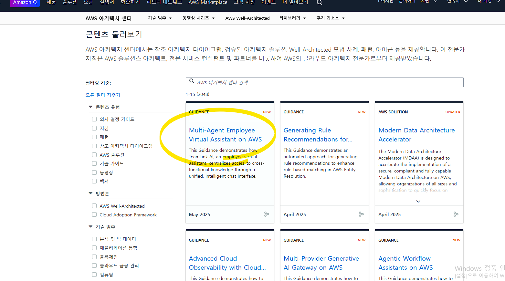
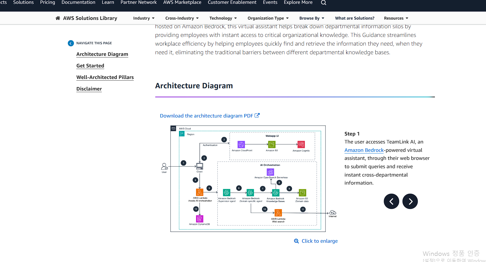
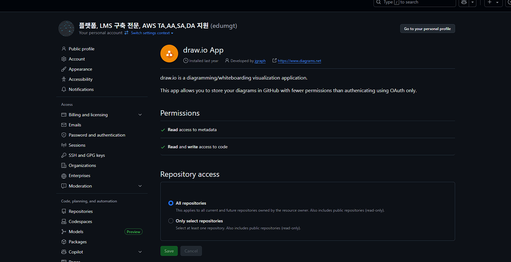
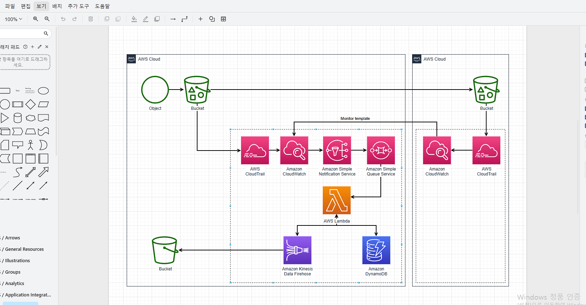

# AWS Serverless Node 학습 메모 (정리본)

> 공개용으로 민감정보(계정 ID, ARN, 개인 링크, API ID 등)는 마스킹했습니다.

## 1) 참고 링크
- Fork 필요 GitHub
  - https://github.com/Carlosrincong/AWS-Solutions-Architect-Associate
  - https://github.com/stacksimplify/aws-eks-kubernetes-masterclass
  - https://github.com/stacksimplify/kubernetes-fundamentals
  - https://github.com/stacksimplify/docker-fundamentals
- Notion
  - CodePipeline: <REDACTED_NOTION_URL>


## 3) AWS Well-Architected
- AWS 공식 아키텍처 사례: https://aws.amazon.com/ko/architecture




## 4) 구성도 작성
- ChatGPT에 구성도 이미지 업로드 후 분석
  - <REDACTED_CHATGPT_SHARE_URL>
- draw.io에서 구성도 작성 후 GitHub 연동 저장




## 5) Serverless 테스트
- Serverless CLI 설치
  - `npm install -g serverless@3` (v4는 별도 인증 필요)

## 6) API Gateway 개요
API Gateway는 클라이언트(웹/앱 등)와 백엔드 서비스(Lambda, EC2 등) 사이의 **중간 관문** 역할을 합니다.


| 역할 | 설명 |
| --- | --- |
| 요청 라우팅 | URL 경로/HTTP 메서드 기준으로 Lambda, EC2 등 분기 |
| 보안 처리 | 인증/인가 (IAM, Cognito, API Key, JWT 등) |
| 속도 제한 | 초당 요청 수 제한 (Throttle) |
| 로깅/모니터링 | CloudWatch Logs 연동 |
| CORS 관리 | 브라우저 API 호출 허용 설정 |
| 응답 변환 | JSON/XML 포맷 변경/필터링 |
| 서버리스 연결 | Lambda와 바로 연결 가능 |

## 7) Lambda 함수 생성
- `index.js` 작성 후 압축
  - `Compress-Archive -Path index.js -DestinationPath function.zip`
  - 일반 압축 툴 사용 가능
- Lambda 함수 생성 명령
  ```bash
  aws lambda create-function \
    --function-name edumgt-lambda-api \
    --runtime nodejs20.x \
    --role arn:aws:iam::<ACCOUNT_ID>:role/<ROLE_NAME> \
    --handler index.handler \
    --zip-file fileb://function.zip \
    --region ap-northeast-2
  ```


## 8) API Gateway REST API 생성 및 Lambda 연동
1. REST API 생성 (AWS Console > API Gateway > REST API)
2. Lambda 함수 연결: `edumgt-lambda-api`


3. 새 리소스 `/hello` 추가


4. 우측 메서드 생성 클릭


5. 메서드 생성 확인 및 배포


6. GET 메서드 추가 → Lambda 통합 설정


7. URL 확인 (목록 중 ID 포함)
- 예: `https://<API_ID>.execute-api.ap-northeast-2.amazonaws.com/dev`


8. 스테이지 생성 후 재배포


9. 기존 API 리소스 삭제 후 재생성 (재배포 시 주의)


