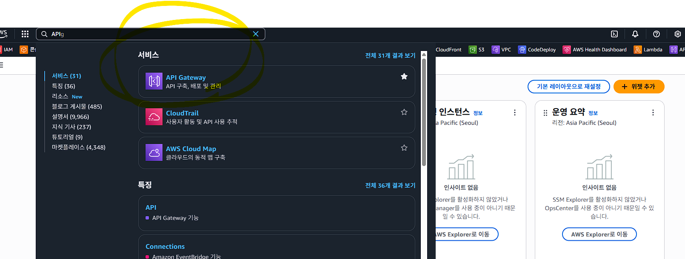
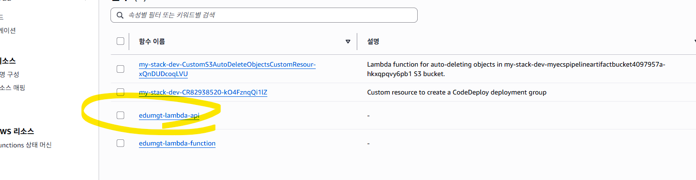
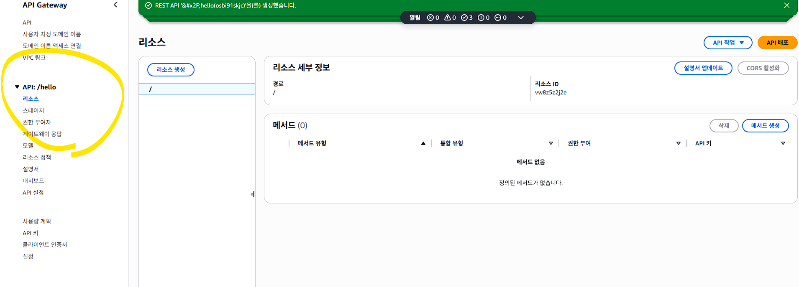
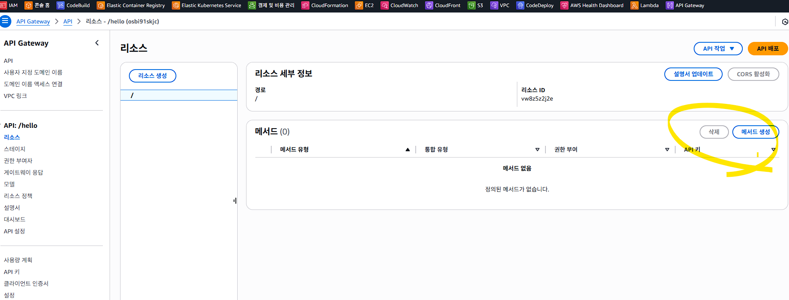
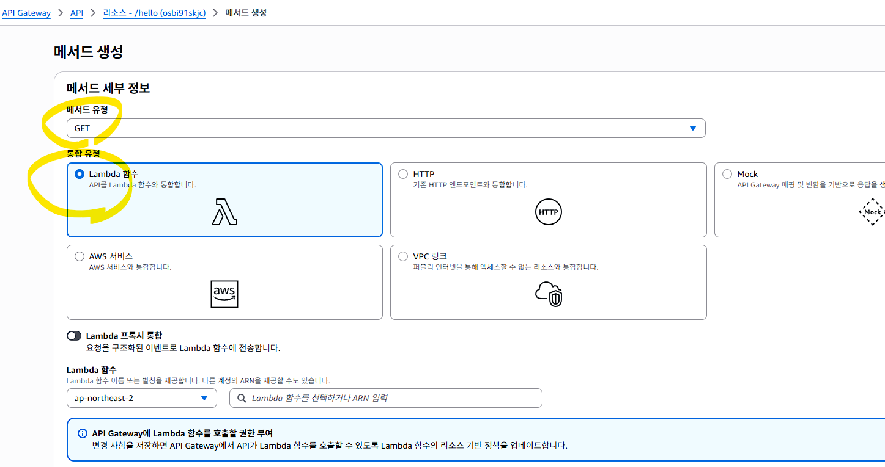
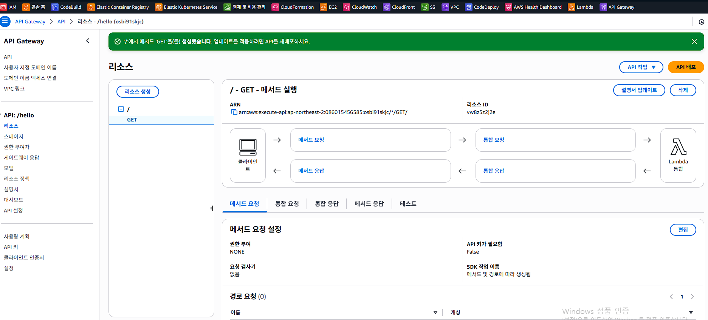
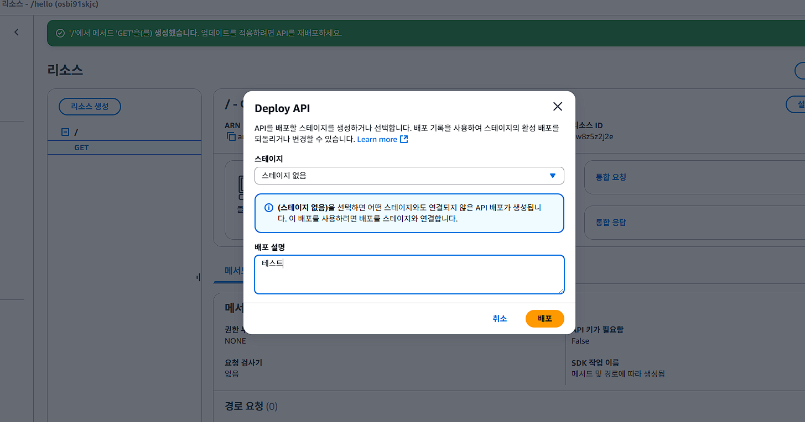
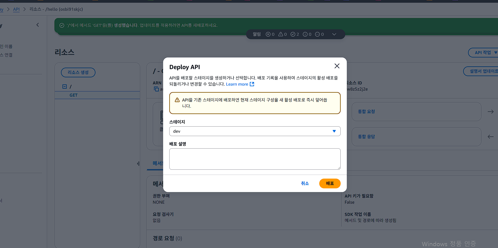

## notion 주소 - https://www.notion.so/CodePipeline-2cc62063ab104fac8ecb70a230d1aca2
## notion 초대 완료
## 0630 수업

## Serverless 테스트

## npm install -g serverless 현재 Version 4 로 인증 별도 필요 - npm install -g serverless@3
## version 3 로 작업

## API gateway 설정

## API Gateway는 클라이언트(웹/앱 등)와 백엔드 서비스(Lambda, EC2, 마이크로서비스 등) 사이의 중간 관문 역할을 하는 서비스
## API Gateway는 외부 요청을 받아 적절한 백엔드로 전달하고, 응답을 다시 사용자에게 반환하는 트래픽 관리자입니다.

| 역할                      | 설명                                                            |
| ----------------------- | ------------------------------------------------------------- |
| **1. 요청 라우팅**           | URL 경로 및 HTTP 메서드(GET, POST 등)를 기준으로 Lambda, EC2, 서비스별로 분기 처리 |
| **2. 보안 처리**            | 인증/인가 (IAM, Cognito, API Key, JWT 등) 기능 제공                    |
| **3. 속도 제한 (Throttle)** | 초당 요청 수 제한하여 abuse 방지                                         |
| **4. 로깅 및 모니터링**        | CloudWatch Logs와 연동되어 모든 API 호출 기록 추적 가능                      |
| **5. CORS 관리**          | 브라우저에서 API 호출 허용 여부 설정 (Access-Control-\* 헤더 처리)              |
| **6. 응답 변환**            | 백엔드에서 받은 JSON/XML을 포맷 변경하거나 필터링 가능                            |
| **7. 무서버(서버리스) 연결**     | Lambda 등과 바로 연결 → EC2 없이 서버 실행 가능                             |

## index.js 작성
## Compress-Archive -Path index.js -DestinationPath function.zip

## 람다펑션 등록
## 펑션 등록
aws lambda create-function --function-name edumgt-lambda-api --runtime nodejs20.x --role arn:aws:iam::086015456585:role/Lamda_S3_Test --handler index.handler --zip-file fileb://function.zip --region ap-northeast-2

## 결과

## REST API 생성
## AWS Console > API Gateway > REST API 생성

## Lambda 함수 연결: edumgt-lambda-api

## 새 리소스 /hello 추가

## 우측의 메서드 생성 클릭

## 메서드 생성 확인 및 배포

## GET 메서드 추가 → Lambda 통합 설정

## URL 확인 - 목록 중 ID 가 있습니다.
## https://osbi91skjc.execute-api.ap-northeast-2.amazonaws.com/dev

## 스테이지를 생성하지 않으면 API Gateway는 외부 호출 가능한 URL을 생성하지 않습니다.
## 스테이지 만들고 다시 배포

## 기존 API 리소스 삭제 후 다시 생성 - 재배포 할때 다음 주의

