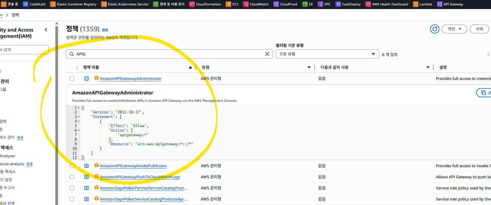
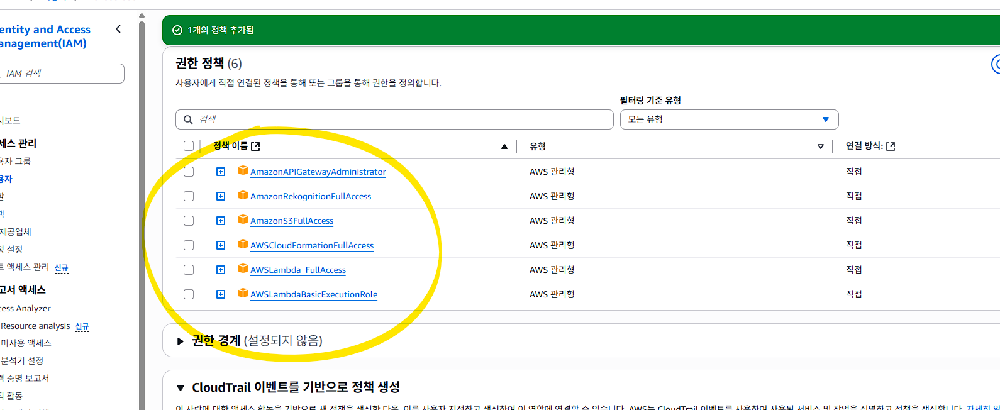
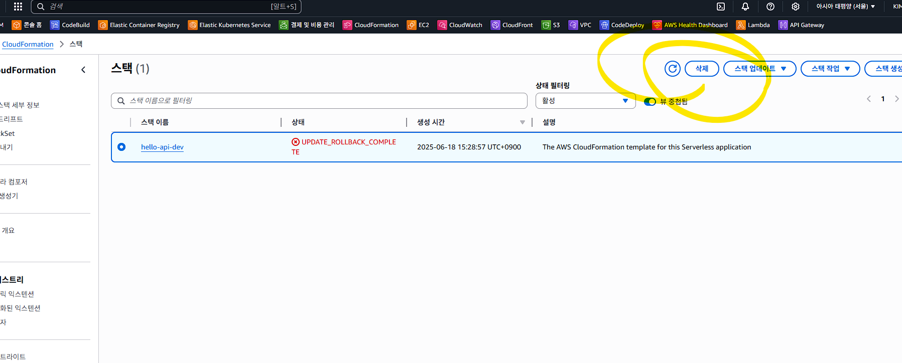
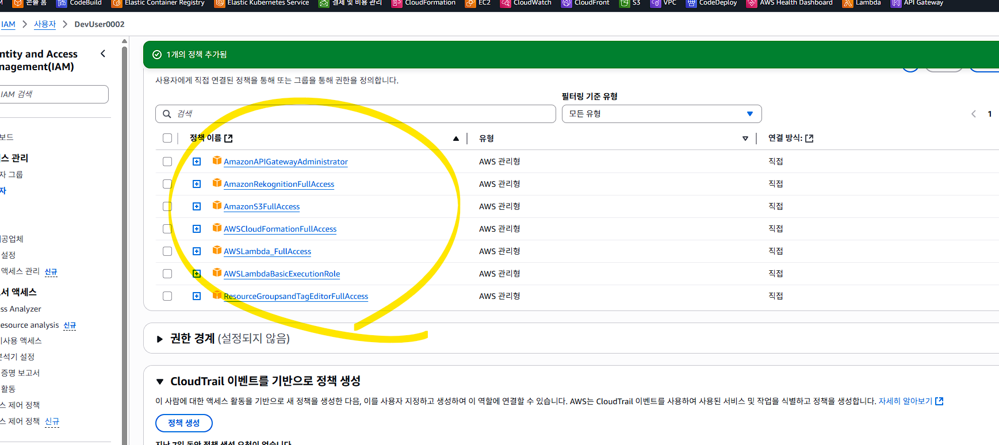
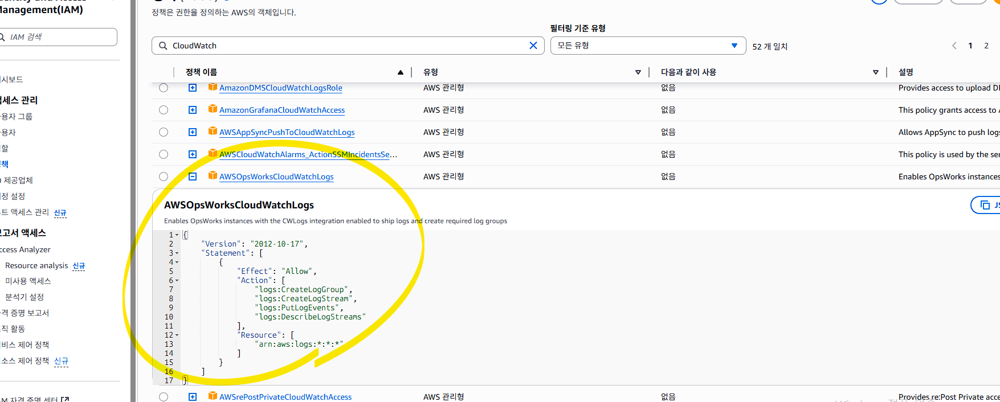
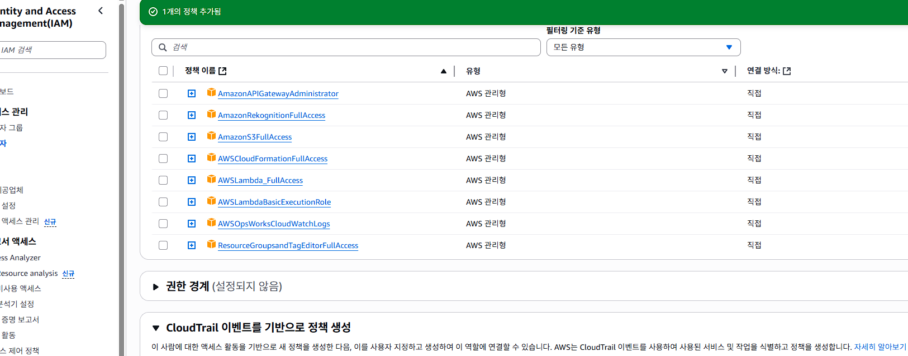
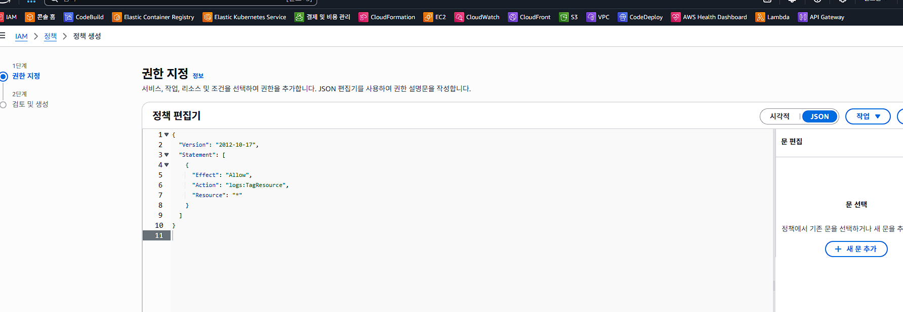
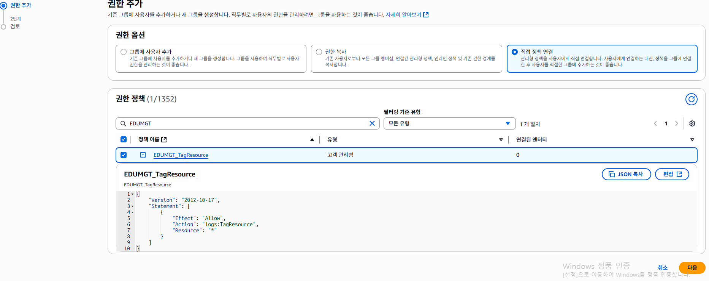
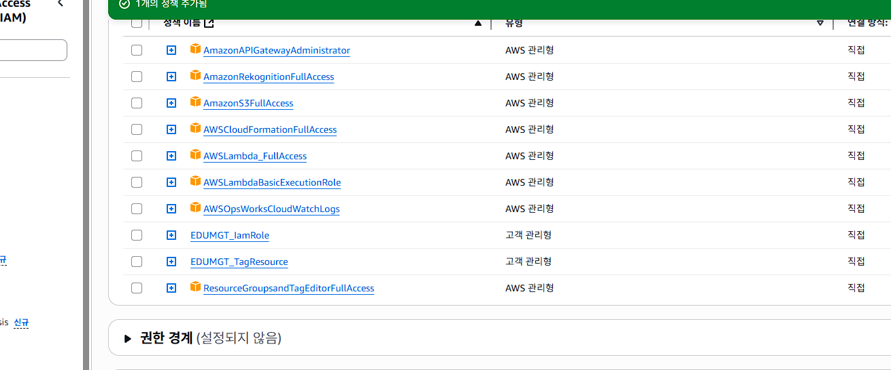
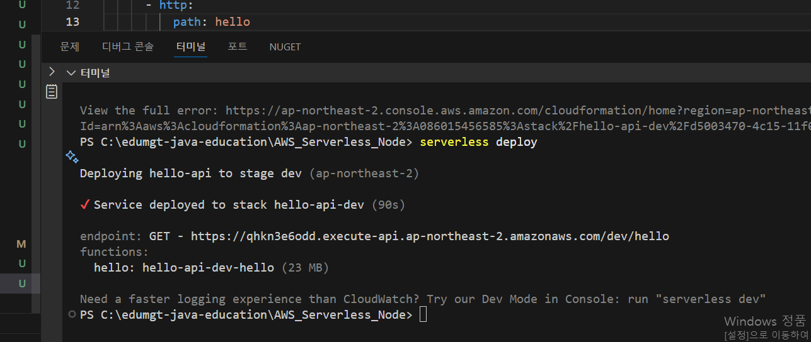

## Node.js 환경에서 말하는 **"Serverless"**는 서버가 없다는 뜻이 아니라,
## **"서버 인프라 관리를 직접 하지 않고 코드 실행만 집중"**하는 개발 방식입니다.

## Node.js로 만든 코드를 Lambda 같은 서비스에 올려서, 서버 설치 없이 실행되게 만드는 방식.
| 기능                       | 설명                                                        |
| ------------------------ | --------------------------------------------------------- |
| **1. 서버 없이 코드 실행**       | Express나 Koa 같은 서버 프레임워크 없이, `handler.js` 함수만 실행          |
| **2. 요청마다 자동으로 인스턴스 생성** | 요청이 올 때마다 Lambda 함수가 자동으로 실행됨                             |
| **3. 사용한 만큼만 비용 부과**     | 초 단위 과금, EC2처럼 항상 켜둘 필요 없음                                |
| **4. 인프라 자동 구성 가능**      | Serverless Framework을 쓰면 API Gateway, IAM, Lambda 등 자동 설정 |
| **5. 코드 배포 자동화**         | `serverless deploy` 한 줄로 전체 배포 가능 (API URL 포함)            |

| 항목    | 전통적인 Node.js 서버 (Express 등) | Serverless (Lambda + API Gateway) |
| ----- | --------------------------- | --------------------------------- |
| 서버 유지 | EC2, PM2 등으로 상시 실행          | 요청 시 자동 실행                        |
| 비용    | 항상 켜두므로 요금 발생               | 호출 시만 과금                          |
| 배포    | 수동 (ssh, git pull, 재시작 등)   | 자동 배포 (`serverless deploy`)       |
| 관리    | 인스턴스, 로드밸런서, 보안 등 직접 관리     | AWS가 관리 (IAM, 보안, 스케일 등 포함)       |
| 성능 튜닝 | 서버 성능 직접 조절 필요              | 동시성 자동 관리, 콜드스타트 주의 필요            |

## serverless deploy

## Error:
User: arn:aws:iam::086015456585:user/DevUser0002 is not authorized to perform: cloudformation:CreateChangeSet on resource: arn:aws:cloudformation:ap-northeast-2:086015456585:stack/hello-api-dev/* because no identity-based policy allows the cloudformation:CreateChangeSet action 

## 위의 에러는 이 에러는 현재 사용 중인 IAM 사용자(DevUser0002)에게
## CloudFormation 스택을 생성 또는 수정할 권한이 없기 때문에 발생한 것입니다

## IAM 사용자에 CloudFormation 권한 부여
## AWS CloudFormation은 AWS 리소스들을 코드로 정의하고 자동으로 생성·관리할 수 있게 
## 해주는 **"인프라스트럭처 자동화 도구"**입니다.
## CloudFormation은 AWS 리소스를 텍스트(YAML/JSON)로 정의하여 자동으로 생성/배포해주는 서비스입니다.
## 수동 클릭 없이 코드로 인프라를 재현하고 버전 관리 가능
## Dev/Stage/Prod 환경을 쉽게 복제
## AWS 콘솔 → IAM → DevUser0002 → 권한 탭 → 정책 추가

## Error:
CREATE_FAILED: ApiGatewayRestApi (AWS::ApiGateway::RestApi)
Resource handler returned message: "User: arn:aws:iam::086015456585:user/DevUser0002 is not authorized to perform: apigateway:PUT on resource: arn:aws:apigateway:ap-northeast-2::/tags/arn%3Aaws%3Aapigateway%3Aap-northeast-2%3A%3A%2Frestapis%2F* because no identity-based policy allows the apigateway:PUT action (Service: ApiGateway, Status Code: 403, Request ID: 9d2119dd-fd58-44c6-9b65-f8e713d0d0a5) (SDK Attempt Count: 1)" (RequestToken: a776abfe-9ab9-b517-1d34-f70cdc528ad6, HandlerErrorCode: AccessDenied)

## 위의 에러 발생 시 API GW 에 대한 권한 문제

## Error:
Stack:arn:aws:cloudformation:ap-northeast-2:086015456585:stack/hello-api-dev/83a1a4e0-4c0d-11f0-99a8-06eb25496439 is in UPDATE_ROLLBACK_COMPLETE_CLEANUP_IN_PROGRESS state and can not be updated.

## 위의 에러 발생 시 cloudformation 의 스택 에러

## 아래의 명령으로 삭제 - 잘 안될 수 있음 - 5분 정도 지연으로 인한 대기 상태 필요
## aws cloudformation delete-stack --stack-name hello-api-dev

## 삭제가 가능하면 다음과 같습니다.

## 삭제 중 제대로 안될때, 전체 삭제

## Error:
CREATE_FAILED: HelloLogGroup (AWS::Logs::LogGroup)
Resource handler returned message: "User with accountId: 086015456585 is not authorized to perform CreateLogGroup with Tags. An additional permission "logs:TagResource" is required. (Service: CloudWatchLogs, Status Code: 400, Request ID: 5f809ff0-072b-4ae2-b4c7-0da04e0f5da2) (SDK Attempt Count: 1)" (RequestToken: 346813b1-b613-f771-9733-8d0acf3c4355, HandlerErrorCode: InvalidRequest)

## Error:
CREATE_FAILED: HelloLogGroup (AWS::Logs::LogGroup)
Resource handler returned message: "User with accountId: 086015456585 is not authorized to perform CreateLogGroup with Tags. An additional permission "logs:TagResource" is required. (Service: CloudWatchLogs, Status Code: 400, Request ID: dee93a06-7786-406f-ace9-026d75d5d97e) (SDK Attempt Count: 1)" (RequestToken: 50e3a8ed-8e14-50ed-6a3a-949ae754a7d8, HandlerErrorCode: InvalidRequest)

## tagresource 에 대한 정책 연결 해도 오류로 인해 직접 정책 생성

## 추가

## Error:
CREATE_FAILED: HelloLogGroup (AWS::Logs::LogGroup)
Resource handler returned message: "Resource of type 'AWS::Logs::LogGroup' with identifier '{"/properties/LogGroupName":"/aws/lambda/hello-api-dev-hello"}' already exists." (RequestToken: 67914ad2-b4fd-3e8e-c0a9-99ad99a86894, HandlerErrorCode: AlreadyExists)

## 로그 그룹 중복으로 해당 로그 그룹 삭제 후 재실행 필요

## 완료 시 다음과 같습니다.

