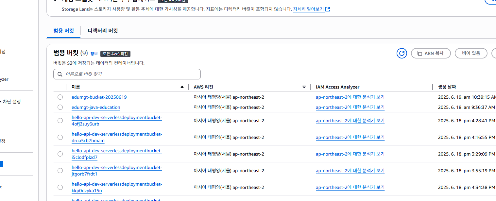

# AWS CLI 연습 (공개용)

> 공개용으로 버킷/로그 이름 등은 마스킹했습니다.

## 1) S3 버킷 생성
```bash
aws s3 mb s3://<BUCKET_NAME>
```



## 2) S3 목록 확인
```bash
aws s3 ls
aws s3 ls s3://<BUCKET_NAME>/
```

## 3) CloudWatch Logs 확인
```bash
aws logs describe-log-groups
aws logs describe-log-streams --log-group-name <LOG_GROUP_NAME>
aws logs get-log-events --log-group-name <LOG_GROUP_NAME> --log-stream-name <LOG_STREAM_NAME>
```


